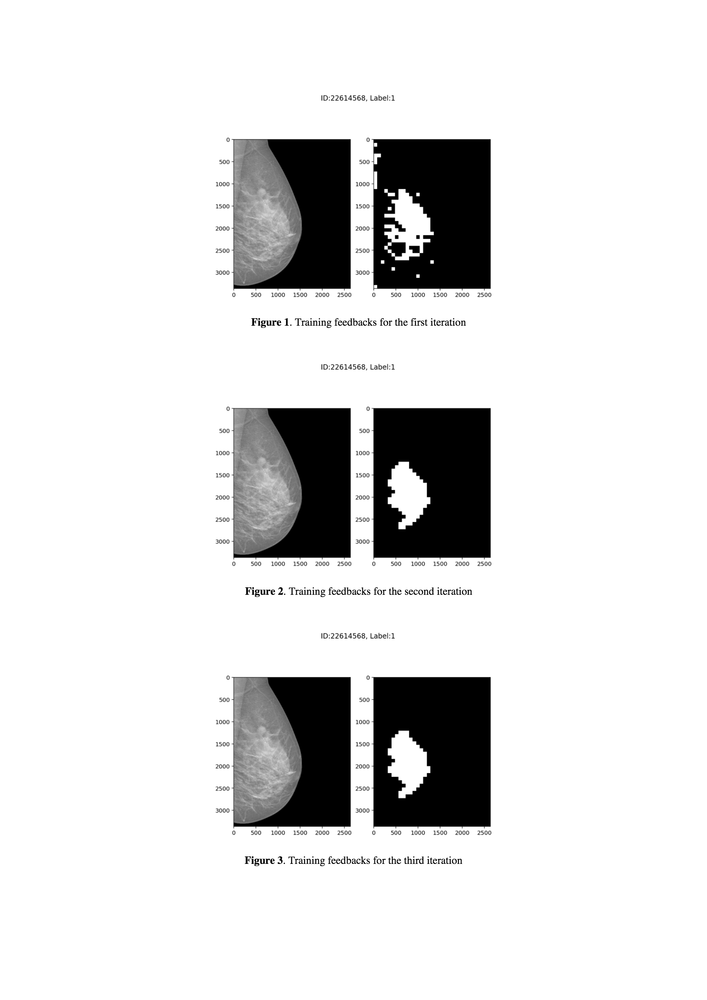

## Multi-Instance-Learning to check breast cancer

    |-- data
    |   |-- L_CC.csv : L_CC dataset predictions
    |   |-- L_ML.xlsx : L_ML dataset predictions
    |   |-- R_CC.csv : R_CC dataset predictions
    |   |-- R_ML.csv : R_ML dataset predictions
    |
    |-- CONFIG.py: Used for setting global parameters
    |
    |-- datafile.py: Used for reading/generating train/validation/test dataset
    |
    |-- model.py: CNN model
    |
    |-- run.py: Main function
    |
    |-- utils.py: Helper functions
    |
    |-- output_test_result.py: Merge the above data files

Multi-Instance-Learning to check breast cancer. An implementation of Patch-based Convolutional Neural Network for Whole Slide Tissue Image Classification.

*Original Paper:* [arXiv:1504.07947](https://arxiv.org/abs/1504.07947)

## Result

## Paper
[PDF Link](materials/project3_report.pdf)
